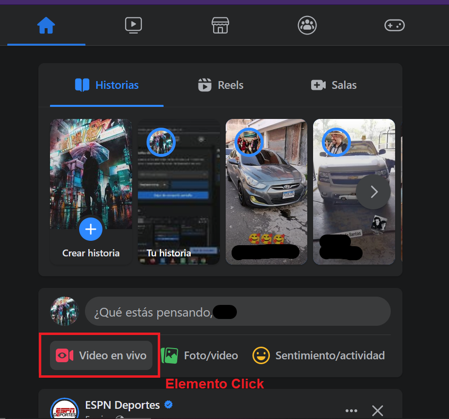

# **Práctica 1**
- Universidad de San Carlos de Guatemala
- Facultad de Ingeniería
- Escuela de Ciencias y Sistemas
- Auxiliar: Ana Isabel Culajay González
---
##### Inteligencia artificial 1 - Sección A 
## Datos

| Carnet    | Nombre |
| 201115018 | Joel Rodríguez Santos |

---

## Tabla de contenidos

* [Objetivos](#objetivos)
* [Conclusiones](#conclusiones)
* [Solución](#solución)
    * [Inicio de transmisión](#inicio-de-transmisión-en-facebook)
    * [Verificar empadronamiento](#verificación-de-empadronamiento)
    * [Consulta y descarga de lugar de votación](#consulta-y-descarga-de-lugar-de-votación)
    * [Finalización de transmisión](#finalización-de-la-transmisión-de-facebook)
* [Opinión](#opinión)
* [Usos profesionales](#usos-profesionales)
* [Usos cotidianos](#usos-cotidianos)

---

## Objetivos

### General
* Utilizar un proceso RPA para para enviar la ubicación del centro de
votación por correo electrónico a los votantes utilizando la herramienta de UIPATH

### Específicos
* Iniciar y finalizar una transmisión en vivo en facebook
* Consultar el estado de empadronamiento de un ciudadano guatemalteco
* Descargar el comprobante generado que indica la ubicación del centro de votación
* Enviar correos electronicos con archivos adjuntos
* Completar la comprensión de un proceso RPA
---
## Conclusiones
* El proceso de RPA es una tecnología que permite realizar tareas repetitivas sin necesidad de la intervención humana a menos que se trate de aplicaciones como el captcha que están creadas especificamente para que estos robots no puedan superarlas.
* La utilización de variables dentro de una proceso de RPA facilita enormemente el manejo de datos dentro de un flujo de procesos ya que elementos como el "insert into" se pueden automatizar para se rellenados con valores guardados en variables.
* Con elementos como "click" o "srcoll down" se puede emular completamente el comportamiento que podría tener una persona al utilizar un mouse, lo que permitiría descargar archivos, rellenar formularios, moverse a través de toda la pantalla, entre otros.
* Creando contraseñas de aplicación en servicios de correo como gmail se pueden enviar correos por medio de SMTP sin la necesidad de utilizar las credenciales de inicio de sesión y asi mantener seguras las cuentas de correo al utilizar estas aplicaciones de terceros. 
---
## Solución

### Elementos utilizados

##### Open Browser
Elemento que permite abrir un navegador o una URL.

##### Use Application/Browser
Elemento que permite abrir una ventana de una aplicación o un navegador.

##### Mouse Scroll
Elemento que permite utilizar el scroll del mouse en la pantalla seleccionada.

##### Click
Elemento que emula la función del mouse tanto para el click derecho como el izquierda o inclusive el doble click.

##### Type Into
Elemento que permite rellenar un cuadro de texto en pantalla mediante una variable o un texto explicitamente configurado.

##### Read Row Workbook
Elemento que permite leer un hoja de excel por filas.

##### Send SMTP Mail Message
Elemento que permite enviar correos electrónicos por medio de SMTP.

##### Input Dialog
Elemento que permite escribir en pantalla un texto y guardarlo en una variable.

### Lectura de datos

Para la lectura de los datos que serán colocados en todos los cuadros de texto de los forms de las páginas se utilizó el elemento "Read Row Workbook" que permitió leer los datos desde una hoja de excel.

### Apertura de explorador

Para abrir el explorador se utilizo el elemento "Use Application/Browser" utilizando la primera url de todo el proceso configurado.

### Utilización de nuevas pestañas

Para seguir utilizando el mismo explorador y solo cambiar de pestañas para las nuevas páginas a visistar se utilizo un "click" para agregar nuevas pestañas y el elemento "Use Application/Browser" para seguir utilizando el mismo explorador ya abierto.

### Inicio de transmisión en facebook

Para el inicio de transmición principalmente se utilizar los elementos de click y type into para los datos que necesita llevar la transmisión como el nombre o la descripción del directo.

A continuación se presentan todos los elementos utilizados y los lugares exactos en donde fueron utilizados:

### Verificación de empadronamiento

Para la verificación de empadronamiento se utilizaron los elementos "click", "type into" para rellenar los cuadros de texto y "Input Dialog" para resolver el captcha.

A continuación se presetan los elementos utilizados y los lugadores en donde fueron utilizados:

## Consulta y descarga de lugar de votación

Para la consulta y descarga del lugar de votación se utilizaron solo los elementos "click" y "type into" para rellenar los cuadros de texto.

A continuación se presetan los elementos utilizados y los lugadores en donde fueron utilizados:

## Envio de correo electrónico

Para el envio del correo electrónico se utilizo el elemento "Send SMTP Mail Message"

Se creó una contraseña de aplicación en gmail y ese es el método que se utiliza para comprobar el inicio de sesión sin utilizar las credenciales del correo. El archivo adjunto se especifica desde la dirección en donde se descarga el comprobante en uno de los pasos anteriores.

### Finalización de la transmisión de facebook

---
## Opinión

La herramienta es muy interesante y muy útil para poder realizar tareas repetitivas asi como todas las herramientas de inteligencia artificila que se han hecho populares en los últimos años; ayudan a ahorrar tiempo en tareas que no necesitan decisiones, solo realizar la misma actividad siempre. La interfaz es muy intuitiva y simple y la utilización de sus elementos también es muy simplista. Cada uno de los elementos tiene su propia definición y sus intrucciones para ser utilizado. El modo de automatización UI es el más útil ya que utiliza su propio algoritmo para adaptarse a los elementos visuales de la pantalla y en la mayoria de los casos no necesita que le usuario realice los anclajes de manera manual, aunque también existe esa posibilidad de hacerlo de manera manual. Los lenguajes de programación que utiliza también permiten mayor personalización y una edición más a detalle de los elementos utilizados además de permitir una mejor organización del espacio de trabajo para los programadores más avanzados, pero eso no imposibilita a otras personas poder utilizar esta herramienta u otras similares.

---
## Usos profesionales
* Utilizandolo en conjunto con otras herramientas como los OCR en la lectura de datos de facturas, se podrían automatizar herramientas tan tediosas, mal diseñadas y precarias como el planiva, en el ingreso de cientos e incluso miles de documentos.
* Para páginas de pedidos en redes sociales como facebook se podria automatizar la copia de estos y llevaros a otro lugar como hojas de calc para tenerlos listos para entregarlos.
* En empresas donde se revisa manualmente el inventario se podria automatizar y que el robot los revise y pida más si es necesario y cumple con los límites que esten previamente configurados.
---
## Usos cotidianos
* Al momento de descargar archivos de varias partes se podría utilizar para que vaya descargando uno por uno y vaya comprobandolos sin la necesidad de estar pendiente de estos.
* Cuando se desea cambiar el nombre de muchos archivos y darles un correlativo e ir cambiando el nombre de cada uno con el autoincremental.
* Para enviar correo electrónicos en donde cambien algunos datos del cuerpo como el nombre o carnet y que se podria realizar con una herramienta RPA alimentandose desde una hoja de excel.
---

