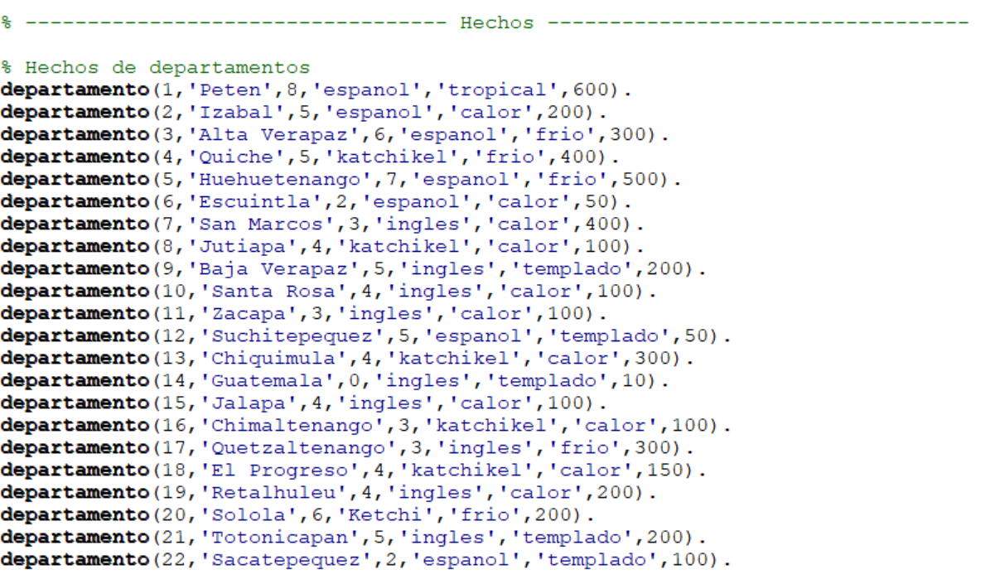
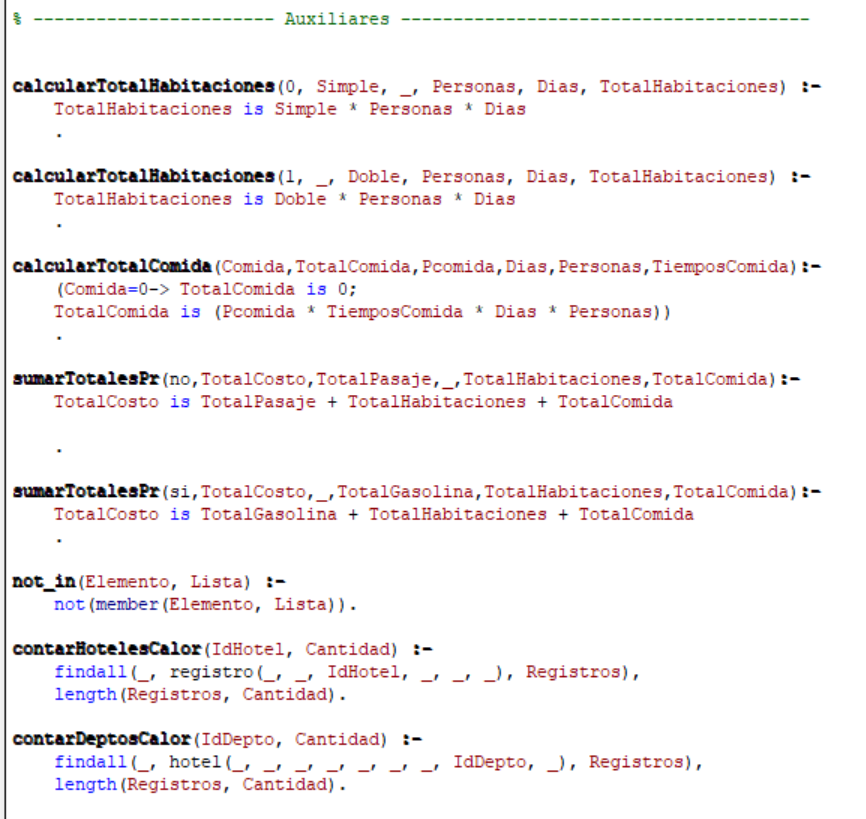
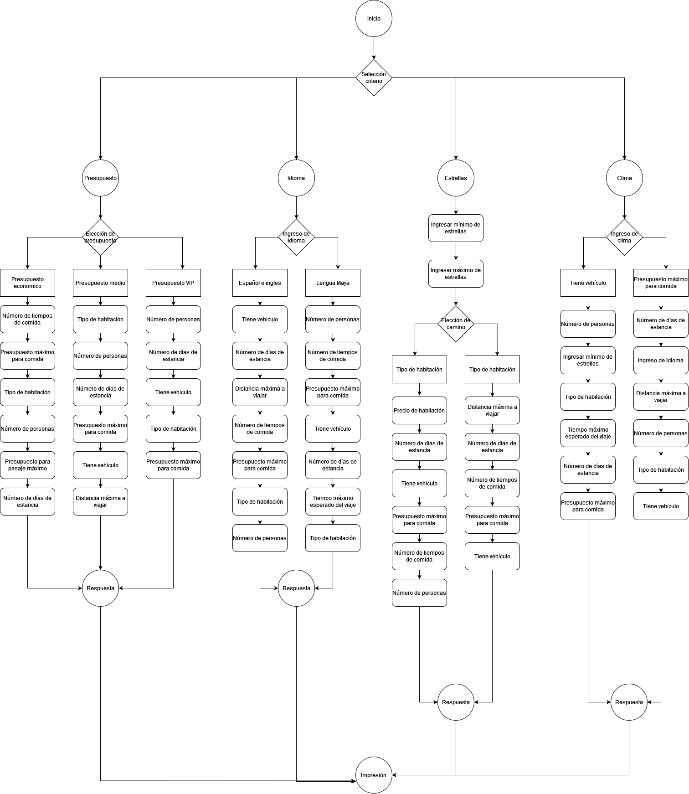

# **Práctica 2**
- Universidad de San Carlos de Guatemala
- Facultad de Ingeniería
- Escuela de Ciencias y Sistemas
- Auxiliar: Ana Isabel Culajay González
- **Inteligencia artificial 1 - Sección A** 
---

## Datos

| Carnet    | Nombre |
|----------|----------|
| 201115018 | Joel Rodríguez Santos |

---

## Tabla de contenidos

* [Objetivos](#objetivos)
* [Conclusiones](#conclusiones)
* [Solución](#solución)
    * [Declaración de hechos](#declaración-de-hechos)
    * [Menús](#menus)
    * [Búsqueda de hoteles](#búsqueda-de-hoteles)
    * [Caminos](#caminos)
    * [Impresión de resultados](#impresión-de-resultados)
    * [Reglas auxiliares](#reglas-auxiliaresk)
    * [Reportes](#reportes)
    * [Encabezados](#encabezados)
* [Diagrama de encadenamiento](#diagrama-de-encadenamiento)
* [Explicación del diagrama de encadenamiento](#explicación-del-diagrama)


---

## Objetivos

### General
* Diseñar un sistema experto para la recomendación de hoteles en Guatemala utilizando la programación lógica

### Específicos
* Diseñar diversos caminos lógicos basandose en diversas opciones y elecciones
* Aplicar filtros y sentecias lógicas sobre los hechos declarados
* Utilizar una base de datos preexistente para crear los hechos dentro del programa
* Utilizar programación lógica y declarativa para la contrucción del sistema experto


---
## Recursos utilizandos por el sistema experto

SO:
- Microsoft Windows 7 (32-64 bits)
- MacOSX 10.14 (x86 x64 Arm64 Intel)
- Linux (Debina, RedHat,Suse,Mageia, otros)

Procesador
- 1 gigahercio (GHz) o más rápido de 32 bits (x86) o de 64 bits (x64) 

RAM
- 1 GB de RAM (32 bits) o 2 GB de RAM (64 bits)

Disco
- 16 GB de espacio disponible en el disco duro (32 bits) o 20 GB (64 bits)

*El programa pesa 42KB y utiliza un máximo de 14MB en ejecución*


---
## Solución

### Declaración de hechos




Los hechos fueron obtenidos de una base de datos de reservaciones de hoteles en departamentos de Guatemala y fueron cargados con estas declaraciones.

Los hechos cargados abarcan las reservaciones, datos de hoteles, datos de clientes, datos de departamentos y datos de los trabajadores.

Los datos utilizados para cada tipo de hechos son los siguientes:
```
departamento(ID,NOMBRE,TIEMPO_VIAJE,LENGUAJE_LOCAL,CLIMA,PASAJE)
hotel(ID_HOTEL,NOMBRE,DIRECCION,ESTRELLAS,HAB_SIMPLE,HAB_DOBLE,PRECIO_COMIDA,DEPARTAMENTO,DISTNACIA)
registro(ID_REGISTRO,CLIENTE,HOTEL,FECHA_REGISTRO,ESTADIA,OPINION)
cliente(ID_CLIENTE,NOMBRE,APELLIDO,PAIS,EDAD,ESTADO_CIVIL,MOTIVO)
trabajador(ID_TRABAJADOR,NOMBRE,CARGO,HOTEL)
```

### Menus

El programa consta de 3 menus para transitar por todas las opciones disponibles: el principal, buscar hotel y reportes.


Los menus están construidos como loops y sentencias en conjunción para que sean mutuamente excluyentes a la hora de que el usuario quiera seleccionar y realizar una acción específica. Se usa disyunción en la opción "0;menu_loop" para retornar a un menu anterior o para finalizar el programa.

Se configuraron otras sentecias para ejecutar la opción diferente de 0 que puede seleccionar el usuario, como el caso 1 que lo redirigira a ejecutar la regla del "menu_criterio" o el 2 que ejecutará la regla "menu_reportes".

A diferencia de los otros 2 menús, el menú de reportes se configuró de tal manera que la ejecución de la próxima regla sea directamente desde esta misma.


Luego de imprimir el menú y pedir al usuario que ingrese una opción, se verifica esa opción y se ejecuta la regla correspondiente.


### Búsqueda de hoteles

Para la búsqueda de hoteles se programó un menú en donde el usuario puede seleccionar 4 formas distintas para encontrar recomendaciónes: por presupuesto, idioma, estrellas o clima; todo esto desde el menú de criterio.


El siguiente paso es utilizar la selección del usuario para ejecutar una de las reglas que desencadenará el camino a seguir para lograr una recomendación.


Los caminos serán explicados más adelante en el diagrama de encadenamiento, pero en general se puede decir que el presupuesto puede desencadenar en 3 reglas; idioma, estrella y clima en 2 cada uno.

Luego de ingresar una de las opciones que se les solicita en cada regla se procederá a ejecutar una serie de caminos predefinidos, los cuales se verán a continuación


### Caminos


Para poder reutilizar los caminos y que fueran independientes del criterio seleccionado se programaron reglas separadas para cada uno de las variables que intervienen en la selección de un hotel. De esta forma se crearon 16 pasos y que son utilizados por los 4 criterios dependiendo de lo que se este buscando en cada criterio.


Por ejemplo, en el caso del criterio del presupuesto se crearon 3 caminos que definen un tipo de presupuesto. Cada uno de ellos utiliza diversos pasos para llegar a la recomendación del hotel. Y esta técnica es reutilizada para cada uno de los 4 criterios. Los pasos se van ejecutando uno tras otro y las variables que son enviadas como parámetros son las que guardan los resultados y que finalmente serán enviadas a la regla de calcularPresupuesto para aplicar los filtros finales e imprimir los resultados.


El siguiente paso, ya con las variables y los resultados de los pasos, se recuperan los datos desde los hechos declarados y se van validando cada uno de los filtros necesario para que la recomendación se acople a lo que esta buscando el usuario. En este caso las variables que se consideran para encontrar una respuesta son: la distancia, precio comida, vehiculo y el tipo de presupuesto seleccionado al inicio.


### Impresión de resultados


La regla que se utiliza para imprimir los resultados en consola reciben las variables (Vehiculo,Hotel,Direccion,TotalComida,TotalPasaje,TotalHabitaciones,TotalComida,TotalCosto) y son impresos con la opción predefinida format. Finalmente se usa fail para que la regla retorne a la anterior y pueda continuar imprimiendo toda la cola de resultados que son enviados desde las reglas anteriores que solicitan la impresión.


### Reglas auxiliares



Se crearon reglas auxiliares para el cálculo del total a gastar por habitaciones dependiendo de si tiene o no un vehículo; el cálculo del gasto total en comida; el cálculo del gasto total dependiendo de si se tiene un vehículo o no; una regla "not_in" para validación de datos dentro de listas; una regla para contar la cantidad de hoteles y departamentos que tiene un clima caluroso; un regla para licmpiar la consola y una regla para verificar selecciones incorrectas en las entradas dentro de los menús.

### Reportes


Los reportes estan constituidos en 3 partes:

1) Se consiguen los datos necesarios para realizar el reporte desde los hechos declarados
2) Se aplican filtros necesarios en el reporte
3) Se imprimen los resultados guardados en las variables con la opción predefinida de prolog "format". Dentro de format se utiliza tabulaciones y tamaños personalizados de las celdas para que la salida sea similar a una tabla.

Ejemplo de salida de un reporte:


### Encabezados


Los encabezados son utilizados para estilizar la salida de los reportes. Se creó un encabezado para cada reporte y 2 para el reporte 4 que tiene 2 salidas.

---

## Conclusiones
* La programación lógica se centra en los resultados que se están buscando basandose en la lógica formal, reglas y hechos declarados en su base de conocimiento.
* En la programación lógica se buscan ciertos resultados sin declarar explicitamente como se deben de conseguir, no es un camino predefinido que haya sido construido para llegar siempre a una respuesta.
* Los sistemas expertos tienen el inconveniente que son cerrados y dificil de adaptarse a situaciones no contempladas. En este caso solo pueden realizar la función de recomendar un hotel.
* Dependiendo del estilo de programación, las reglas creadas y los hechos declarados pueden ser fácilmente reutilizados en todo el programa y no dependen de algo más para ser utilizados.
---
## Diagrama de encadenamiento




---
### Explicación del diagrama

En el diagrama se puede observar que luego del inicio del programa se procede a preguntar cual de los 4 criterios se desea utilizar como guia para llegar a una o varias recomendaciones de hoteles para visitar.

Los criterios son 4: presupuesto, idioma, estrellas del hotel y clima. Cada uno de ellos tiene caminos diferentes, preguntas diferentes y resultados diferentes.

En el lado del presupuesto se cuenta con 3 opciones: presupuesto económico (0-1600), medio (1600-3400) y VIP (>3400). Como se pudo observar en el código anteriormente los pasos de los caminos fueron creados como reglas independientes e intercambiables por lo que es simple usarlas en cualquiera de los caminos.

A continuación se enumeran los pasos creados y los datos que esperan:

1) Presupuesto : Espera una respuesta entre 1-3, opciones que representan los 3 tipos de presupuestos disponibles.
2) Dias : Espera una respuesta númerica de los días de estancia esperados del usuario.
3) Habitacion : Espera una respuesta numérica entre 1-2, opciones que representan los 2 tipos de habitaciones disponibles, la simple y la doble.
4) Personas : Espera una respuesta numérica que indica el número de personas que se espera que viajen.
5) Vehiculo : Espera una respusta de texto (si/no) para saber si tiene o no un vehículo y calcular ya sea el precio total de la gasolina o de los pasajes de transporte.
6) Distancia : Espera como respuest la distancia que estan dispuestos a viajas los usuarios.
7) Comida : Espera como respuesta la cantidad máxima de dinero que estan dispuestos los usuarios a gastar en comida.
8) Idioma : Espera como respuesta un número de 1-4 que representan el idioma que desean los usuarios que tenga el hotel a visitar.
9) Tiempo : Espera como respuesta el tiempo total que estan dispuestos los usuarios a pasar en el viaje.
10) Limpieza : Espera como respuesta los hoteles que tengan servicio de limpieza o trabajadores de limpieza.
11) Clima :  Espera como respuesta un número que representan uno de los 4 tipos de climas que pueden encontrar los usuarios en los departamentos.
12) EstrellasMax : Espera como respuesta el número de estrella máximo que espera el usuario que tenga el hotel a visitar.
13) EstrellasMin : Espera como respuesta el número de estrella mínimo que espera el usuario que tenga el hotel a visitar.
14) PrecioHabitacion : Espera como respuesta la cantidad máxima de dinero que esta dispuesto a gastar el cliente en una habitación
15) TiemposComida : Espera como respuesta la cantidad de comidas que el usuario hace por día. 
16) PasajeMaximo : Espera como respuesta la cantidad de dinero máxima que esta dispuesto a gastar el usuario en pasajes hacia los hoteles.

Los caminos se definen dependiendo de la respuesta de la primera pregunta en cada uno de los 4 criterios. Para el presupuesto existen 3 caminos distintos e igual número de tipos de presupuesto; en clima, idioma y estrellas existen 2 caminos distintos. Para clima se unieron los climas similares para hacer caminos similares, en este caso calor con tropial y templado con frio. En los idiomas las opciones se separaron por lenguajes que no son mayas y lenguas que son mayas, y por último para la estrellas se separan los caminos entre los que más estrellas tienen y los que menos tienen.


* Para el presupuesto económico lo que se busca es maximizar las opciones de personalización del usuario para que pueda decidir cada precio de cada servicio como es el caso de la cantidad de los tiempos de comida o el presupuesto para pasaje máximo. Como se esta buscando minimizar el gasto en esta opción no se toma en cuenta el tema del vehículo ya que la gasolina en la mayoría de los hoteles tiende a aumentar bastante el gasto total, variable que si se toma en consideración en los presupuestos medio y VIP, aunque en estos hay menos opciones de personalización como el tema de los tiempos de comida ya que se dan, por defecto, 3 tiempos de comida en cada uno de ellos. La ventaja de estos últimos es que son más simples de configurar ya que no se busca tanto minimizar el dinero, en su lugar se busca aumentar la comodidad, por lo que se utilizan, por ejemplo, los pasos de la distancia o el mismo paso del vehículo.

* En el idioma, las estrellas y el clima se toman más en cuenta variables de comodidad y se trata de evitar las variables que modifican el presupuesto final ya que la intención es mostrar todas las opciones posibles que cumplan con las especificaciones no monetarias del usuario. Acá se encuentra pasos como la distancia, el tiempo de viaje, presupuesto para comida o los tipos de habitación disponibles. En el camino de clima también se vuelven a reusar las variables principales de idioma y estrellas minimas que definen uno de los 4 criterios principales. 

Todos los resultados seran inferidos utilizando todas las respuesta que el usuario de y construyendo su propio camino.


