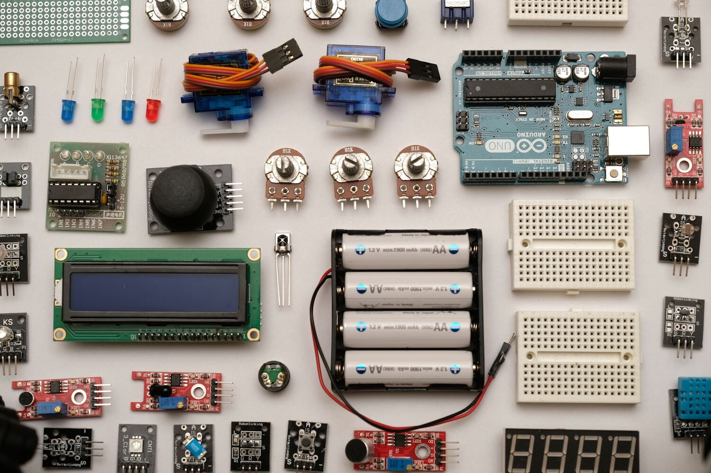

# **Práctica 4**
- Universidad de San Carlos de Guatemala
- Facultad de Ingeniería
- Escuela de Ciencias y Sistemas
- Auxiliar: Ana Isabel Culajay González
- **Inteligencia artificial 1 - Sección A** 
---

## Datos

| Carnet    | Nombre |
|----------|----------|
| 201115018 | Joel Rodríguez Santos |

---

## Tabla de contenidos

* [Objetivos](#objetivos)
* [Conclusiones](#conclusiones)
* [Solución](#solución)
    * [Declaración de hechos](#declaración-de-hechos)
    * [Menús](#menus)
    * [Búsqueda de hoteles](#búsqueda-de-hoteles)
    * [Caminos](#caminos)
    * [Impresión de resultados](#impresión-de-resultados)
    * [Reglas auxiliares](#reglas-auxiliaresk)
    * [Reportes](#reportes)
    * [Encabezados](#encabezados)
* [Diagrama de encadenamiento](#diagrama-de-encadenamiento)
* [Explicación del diagrama de encadenamiento](#explicación-del-diagrama)

---

## Objetivos

### General
* Diseñar un una solución de realidad virtual para el manejo de información de 25 cursos de la carrera de ingeniería en la USAC

### Específicos
* Diseñar las interfaces utilizando Unity y Vuforia
* Integrar elementos multimedia con elementos 3d en cada curso
* Construir targets adecuados para un mejor sentido de percepción para la AR
* Creación de acciones con botones virtuales y manejo de menús e interfaces virtuales con los mismos

---
## Recursos requeridos

SO:
- Windows 7 (SP1+), Windows 10 y  Windows 11, 64-bit.

Procesador
- X64 architecture con soporte de instrucciones SSE2

RAM
- 1GB+ RAM 

Gráficos
- DX10, DX11, y DX12-capable GPUs

*El programa pesa 42KB y utiliza un máximo de 14MB en ejecución*

---
## Solución

### Targets

#### Química

#### Features

#### Ciencias y Sistemas

#### Features

#### Electrónica

#### Features

#### Civil

#### Features

#### Industrial

#### Features

Como se pueden obervar los "features" son grandes grupos de puntos que estan en lugares importantes justo donde se tenia planea agregar botones virtuales.

---

### Estructura utilizada en Unity

Con los targets se crearon elementos 3d para contener figuras que se hacen pasar por botones que al final estan sobre los verdaderos botones, los botones virtuales que son los que activan todas las demás funcionalidades.

Para manejar los botones se utilizaron planes para colocarlos en grupos y poder manejarlos por medio del bloque padre. La función que se utliza para mostrar y ocultar los elementos son los atributos de visibilidad que tienen todos los componentes, configurandolos de tal manera que solo se pueda mostrar ya sea un target o el menú principal.

Para manejar el ocultamiento o muestra de los targets y el menú pricipal, se han programado disntitos componentes que ayudan a detectar los estados de otros componentes y decidir cual es el siguiente paso, esto incluyendo audios y/o vídeos.

Los elementos 3d también fueron agregados como hijos de elementos "planes" para poder manejar mejor su ocultamiento que esten sobre una superficie plana para poder observarlos de mejor manera.

## Vistas preliminares de las interfaces 

Se utilizaron 2 posiciones para los botones, en la parte superior e inferior de la pantalla. Se agregaron 5 juegos de paneles con resultados al clickar cualquiera de las opciones de botones que hay de tal manera de que se muestrne los datos programados y se reproduzcan los multimedia agregados.

#### Tabla de elementos por carrera y curso 

| ingenieria          | curso                       | texto | audio | video | imagen | elemencto 3d |
|---------------------|-----------------------------|-------|-------|-------|--------|--------------|
| Quimica             | Bioingeniería               | *     | *     |       |        | *            |
|                     | Química Orgnánica           | *     |       | *     | *      |              |
|                     | Termodinámica               | *     | *     |       | *      |              |
|                     | Flujo de Fluidos            | *     |       | *     | *      |              |
|                     | Bioingeniería               | *     |       | *     | *      |              |
| Ciencias y Sistemas | Sistemas Operativos 1       | *     |       | *     | *      |              |
|                     | Redes de Compu. 1           | *     |       | *     | *      |              |
|                     | Bases de Datos 1            | *     | *     |       | *      |              |
|                     | Software Avanzado           | *     |       | *     | *      |              |
|                     | IA 1                        | *     |       | *     |        | *            |
| Electrónica         | Electrónica 1               | *     | *     |       |        | *            |
|                     | Circuitos Electrónicos 1    | *     |       | *     | *      |              |
|                     | Teoría Electro- magnética 1 | *     |       | *     | *      |              |
|                     | Sistemas de Control 1       | *     |       | *     | *      |              |
|                     | Robótica                    | *     |       | *     | *      |              |
| Civil               | Geología                    | *     |       | *     | *      |              |
|                     | Geografía                   | *     |       | *     | *      |              |
|                     | Hidráulica                  | *     | *     |       | *      |              |
|                     | Petrología                  | *     |       | *     | *      |              |
|                     | Topografía 1                | *     | *     |       | *      |              |
| Industrial          | Microeconomía               | *     |       | *     | *      |              |
|                     | Gestión ambiental           | *     |       | *     | *      |              |
|                     | Ingeniería de costos        | *     |       | *     | *      |              |
|                     | Gestión de proyectos        | *     |       | *     | *      |              |
|                     | Diseño industrial           | *     |       | *     |        | *            |

# Opinión de Vuforia

* Vuforia es una plataforma de realidad aumentada muy popular que brinda una experiencia destacada en el desarrollo y la implementación de aplicaciones de RA. Puede generar puntos de acceso a la virtualidad mediante targets que proporcionan la posibilidad de adherir elementos 3d a la interacción cuasi física con el mundo virtual. Su capacidad para detectar y rastrear objetos en tiempo real es bastante grande, y su compatibilidad con diferentes dispositivos y plataformas la convierte en una opción muy accesible, ya que permite crear proyectos tanto para SOs como windows o android, y todo desde Unity. Vuforia ofrece una amplia gama de características y funcionalidades, como la superposición de imágenes y objetos virtuales, así como el reconocimiento de movimientos y marcadores. Su interfaz de programación intuitiva facilita a los desarrolladores la creación eficiente de experiencias de RA. Vuforia no es una herramienta muy pesada que utlice gran cantidad de recursos del equipo por lo que la hace una opción interesante, además de que la propia compañia proporciona licencias gratuitas y personales para probar la tecnología, lo que la hace más accesible para iniciarse en el mundo de AR.

---

# Usos prácticos de la realidad aumentada en su vida cotidiana
* Puede ofrecer tours y visitas a lugares turísticos o historicos en los cuales se podría interactuar con elementos virtuales de la época, logrando revivir momentos que no podrían ser experimentados en la vida real.
* Con la gama de productos VR, la AR ya esta ayudando a las personas a ejercitarse sin salir del hogar y sin equipamientos. Hay programas o videojuegos como Meta Quest o Box Vr. Estos programas son creados especificamente para ejercitar a las personas mientras se divierten y asi logran evitar el sedentarimos que generamente propulsan este tipo de dispositivos.
* Otro avance importante para la AR se encuentra en los "retails" que ya permiten a sus usuarios visualizar los productos desde la AR para poder ver como son antes de comprarlos y poder darse una idea muy apegada a la realidad de lo que estan tratando de adquirir antes de hacerlo. Amazon es una de esas empresas en las cuales ya se pueden "probar" los productos sin la necesidad de comprarlos o ir a alguna tienda física. 
# Usos prácticos de la realidad aumentada en su vida laboral
* Digitalizando equipos de computo, por ejemplo, los técnicos podrian ofrecer soporte utilizando la AR para verificar equipos, realizar actividades y generar reportes, de tal manera que se esten diagnosticando los equipos a distancia de una manera más apegada a la realidad y no como comunmente se hace, ya sea por teléfono, presencial o por conexión remota.
* Mediante el uso de la RA, los profesionales pueden transformar sus presentaciones convencionales en experiencias inmersivas y cautivadoras. Al agregar elementos visuales interactivos, como gráficos en 3D, modelos virtuales y animaciones, pueden captar la atención de la audiencia de manera más efectiva y transmitir información de manera más memorable.
* Podría emplearse para proporcionar programas de capacitación interactivos y prácticos, lo que permitiría a los empleados adquirir nuevas habilidades y conocimientos a través de experiencias de RA en entornos virtuales. Esta tecnología brinda la oportunidad de practicar de forma segura antes de aplicar los conocimientos en situaciones reales, lo que resulta en un aumento de la confianza y la competencia.

## Conclusiones
* La realidad aumentada se puede utilizar mediante la herramienta vuforia para la creación de elementos que pueden interactuar con el mundo real y realizar acciones, al mismo tiemo, en el mundo virtual de tal manera que se puedan cambiar estados de variables virtuales con movimientos en la vida real.
* Para la creación de buenos targets y para que funcionen de la mejor manera con las herramientas de AR, estos tienen que ser muy detallados y huir de la simplicidad ya que esta evita que se puedan generar más y mejores "features", de tal manera que todos los elemenots sean más sensibles y fáciles de reconocer para el programa.
* La manera más adecuada de programar los elementos de realidad virtual es siguiendo la filosofía que utilizan otras herramientas como React o angular, la programación en componentes, ya que esto permite poder editar tanto los componentes de manera individual como de manera grupal. Al utilizar componentes padres que agrupan a otros más pequeño se hace más simple y ordenado el manejo de estos.
* Imágenes con pocos "features" perjudican el proyecto de tal manera que en espacios vacios o sin muchos "features" se dejan de percibir los impulsos desde el mundo real para interactuar con los elementos de AR, haciendo que estos sean irreconocibles para los programas y que finalmente no se pueda influir en la realidad virtual desde el mundo real.
---

